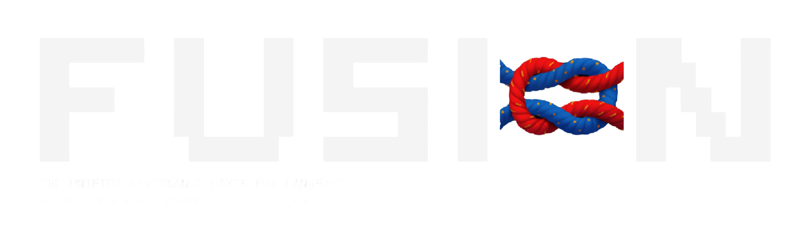

# Fusion | A unified layer for LLM tracing



**One layer to rule your tracing, over Claude Code, Codex, Cursor, Hermes — one authority over capture and routing into your Langfuse projects.**

You already have Langfuse. The problem is everything _around_ it: each coding client speaks a different telemetry story, nothing stamps **which repo / which project** at the source, and you cannot tell from one place whether capture is actually flowing, only configured, or on a path Fusion never sees. Fusion is the local control plane that closes that gap.

**What you get:** stand up Langfuse in Docker (or point at cloud), wire Claude Code and Codex through the OTLP bridge container, send BYOK Cursor and Hermes traffic through a local gateway, map a directory → project with a `.fusion` file, and see coverage + take govern actions from the CLI, MCP, or console. Fusion stays on this machine (`127.0.0.1`).

**Today vs Fusion**

| Today                                                                                              | With Fusion                                                                                                                      |
| -------------------------------------------------------------------------------------------------- | -------------------------------------------------------------------------------------------------------------------------------- |
| Each client has its own OTEL/env/config ritual. You re-learn it when someone adds Codex or Hermes. | One `enable` (or gateway base URL). Claude Code and Codex share the bridge; Cursor and Hermes share the gateway.                 |
| A trace lands in Langfuse with no idea which repo it came from. You grep paths after the fact.     | `.fusion` + hook (or the gateway) stamp `project=` at the source. Fusion does not guess it later from the trace.                 |
| Cursor on a subscription looks “on” and emits nothing local. You find out weeks later.             | Coverage says **subscription** — that is normal, not a failure. BYOK through the gateway is the only Cursor path Fusion can see. |
| Keys, hosts, and “is the collector even up?” live in five Slack threads.                           | `fusion doctor` / the console: daemon, bridge, gateway, Langfuse auth, who’s wired.                                              |

---

## Others can govern, so why Langfuse?

Langfuse has quietly become the default pick for developers building LLM applications. It’s self-hostable for free, and built on OpenTelemetry, so it fits cleanly into any stack. That matters when you care about data sovereignty, compliance, and avoiding vendor lock-in.

At the same time it’s fast at scale: dashboards stay snappy with large trace volumes, and unit-based pricing with unlimited seats keeps cost predictable as usage gro*ws.*

Developers love Langfuse. Fusion is the unified layer so the clients they already use — Claude Code, Codex, Cursor, Hermes — all land there.

---

## Fusion Clients

Claude Code and Codex send OTLP to the bridge (`:4318`). Cursor and Hermes use the gateway (`:4600` — your keys; Fusion forwards and logs).

| Client          | Capture                                                                    | Wire                                                           |
| --------------- | -------------------------------------------------------------------------- | -------------------------------------------------------------- |
| **Claude Code** | OTLP → bridge `:4318`                                                      | `fusion enable claude-code` (env file; `source` before launch) |
| **Codex**       | OTLP → same bridge (Codex patch on the collector)                          | `fusion enable codex` (`~/.codex/config.toml`)                 |
| **Cursor**      | Gateway `:4600` (BYOK). Subscription traffic **bypasses** — Fusion says so | Point the client at the gateway; not `enable`                  |
| **Hermes**      | Gateway `:4600` (Fusion runs `hermes config set`)                          | `fusion enable hermes`                                         |

---

## Setup

Same govern actions from the Fusion CLI, from MCP in Cursor or Hermes, or from `fusion ui`. `init`, `host`, `up`, and the shell hook stay on the Fusion CLI.

### CLI

`init`, `host --local`, `up` / `down`, `enable` / `disable`, `project` / `route`, `connect`, `doctor` / `status`, `ui`, `config`.

**1. Choose where traces land**

```bash
fusion init                     # finds existing Langfuse, then TTY / --sink use-local | use-cloud | docker-local | cloud | gateway-only
```

Fusion **discovers** Langfuse you already have (Docker, MCP config, `LANGFUSE_` env, local processes that answer Langfuse health). It does not hardcode a local port. `fusion host --local` is only for a stack Fusion itself starts — skip it if Fusion already found one. Cloud can use keys Fusion already found in Cursor or Hermes. Gateway-only is Node only.

**2. Start Fusion**

```bash
fusion up
```

This machine then has UI/control on `:4599`, the gateway on `:4600`, and the OTLP bridge on `:4318`.

**3. Capture**

```bash
fusion enable claude-code       # and/or: fusion enable codex | hermes
fusion project link . --to my-project
eval "$(fusion hook zsh)"       # once in ~/.zshrc (or bash)
```

Work in the linked directory. The project is stamped there (`.fusion` + hook) or on the gateway. Done when Langfuse shows a trace tagged `service:` + `project:`.

`fusion doctor` checks the pipeline and can write Langfuse keys. `fusion status` is the same list without calling Langfuse.

### Fusion MCP 

Same tools in Cursor and Hermes. The agent turns on capture, links a folder, checks coverage — keys stay in Fusion config,

```bash
fusion connect cursor           # ~/.cursor/mcp.json
fusion connect hermes           # ~/.hermes/config.yaml (CLI and Desktop)
```

Restart the client, start a new session, ask Fusion (status, enable Hermes/Codex, link this repo). Tools are `fusion_*` / `mcp_fusion_*`.

|            | Fusion MCP                                                                                                                            | Langfuse MCP                              |
| ---------- | ------------------------------------------------------------------------------------------------------------------------------------- | ----------------------------------------- |
| Job        | Set up capture and routing on this machine                                                                                            | Look at data already in Langfuse          |
| You ask it | “Point this folder at project X.” “Turn on Codex.” “Is Cursor actually sending traces, or is it on a subscription that skips Fusion?” | “What are the last traces for project X?” |
| Tools      | Table below                                                                                                                           | Langfuse’s own (traces, scores, prompts)  |

**Fusion MCP tools**

| Tool                     | Function                                                                                         |
| ------------------------ | ------------------------------------------------------------------------------------------------ |
| `fusion_status`          | Health of daemon, gateway, bridge, targets                                                       |
| `fusion_coverage`        | FLOWING / CONFIGURED / SUBSCRIPTION / BYPASSED / DOWN + routes                                   |
| `fusion_targets_list`    | Configured Langfuse targets, which is active                                                     |
| `fusion_routes_list`     | Directory → project links                                                                        |
| `fusion_target_test`     | Live ping to a target                                                                            |
| `fusion_project_link`    | Bind a directory to a project                                                                    |
| `fusion_target_add`      | Add a Langfuse target (keys validated)                                                           |
| `fusion_target_set_keys` | Replace keys on a target                                                                         |
| `fusion_set_active`      | Switch active target                                                                             |
| `fusion_enable_source`   | Wire Claude Code, Codex, or Hermes                                                               |
| `fusion_prices_sync`     | Register current model prices on the active Langfuse (fetches OpenRouter, falls back to bundled) |

### UI

`fusion ui` — `http://127.0.0.1:4599`, one board: health, clients, routing, govern, and docs.

**What the console shows and does**

- **Pipeline health** — daemon, gateway, bridge, Langfuse reachability (the same chain `fusion doctor` checks).
- **What's connected** — each client as FLOWING / CONFIGURED / SUBSCRIPTION / BYPASSED / DOWN. Flowing means a recent tagged trace, not token volume. Subscription is Cursor’s usual path, not a failure.
- **Routing map** — directory → project → target.
- **Open Langfuse** — traces, metrics, and cost live there; Fusion only deep-links.
- **Add a Langfuse target** — test keys, then save.
- **Link a directory to a project** — so traces are tagged at the source.
- **Enable Claude Code, Codex, or Hermes capture** — writes the client config Fusion needs.
- **Sync model prices** — onto the active Langfuse so it can compute cost. Fusion fetches current prices from OpenRouter and falls back to bundled values only when the network is unavailable.
